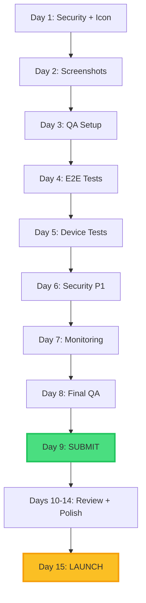

# 📅 Daily Vibe Check - Critical Path to Launch

**Target Launch Date:** November 15, 2025  
**Submission Deadline:** November 8, 2025  
**Days Remaining:** 18 days  
**Team Capacity:** Assuming 2 FTE (Full-Time Equivalent)

---

## Week 1: November 1-3 (P0 Blockers)

### Day 1 (Nov 1) - Security & Store Assets
**Owner: DevOps + Design**

| Task | Time | Owner | Blocker | Output |
|------|------|-------|---------|--------|
| Enable leaked password protection | 0.5h | DevOps | ✅ | Supabase Auth configured |
| Create 1024x1024 app icon | 1h | Design | ✅ | store/icon-1024.png |
| Start iPhone screenshots | 2h | Design | ✅ | 2-3 screenshots ready |

**End of Day:** 3.5 hours completed, security hardened, icon ready

---

### Day 2 (Nov 2) - Store Assets Completion
**Owner: Design + Product**

| Task | Time | Owner | Blocker | Output |
|------|------|-------|---------|--------|
| Finish iPhone screenshots (both sizes) | 2h | Design | ✅ | 6+ screenshots per size |
| Complete IARC questionnaire | 1h | Product | ✅ | Content rating approved |
| Verify Google Play Data Safety form | 2h | Product | ✅ | Form submitted |
| Add 2 more Android screenshots | 2h | Design | - | Total 5 screenshots |

**End of Day:** 7 hours completed, all store assets ready

---

### Day 3 (Nov 3) - QA & Payments
**Owner: QA + Backend**

| Task | Time | Owner | Blocker | Output |
|------|------|-------|---------|--------|
| Execute E2E test suite (Tests 1-4) | 4h | QA | ✅ | 50% tests passed |
| Enable Stripe live mode | 1h | Backend | ✅ | STRIPE_LIVE_MODE=true |
| Complete $1 test transaction | 1h | Backend | Depends: Stripe | Order confirmed |
| Test refund flow | 1h | Backend | Depends: $1 test | Refund processed |

**End of Day:** 7 hours completed, payments working in live mode

---

## Week 2: November 4-7 (P0 + P1 High Priority)

### Day 4 (Nov 4) - Testing Completion
**Owner: QA**

| Task | Time | Owner | Blocker | Output |
|------|------|-------|---------|--------|
| Finish E2E test suite (Tests 5-8) | 4h | QA | ✅ | All tests passed |
| Physical device testing (iPhone) | 3h | QA | - | iOS verified |

**End of Day:** 7 hours completed, mobile testing 50% done

---

### Day 5 (Nov 5) - Device Testing & Performance
**Owner: QA + Frontend**

| Task | Time | Owner | Blocker | Output |
|------|------|-------|---------|--------|
| Physical device testing (Android) | 3h | QA | - | Android verified |
| Run Lighthouse audit (production) | 2h | Frontend | - | Scores documented |
| Fix critical performance issues (if any) | 2h | Frontend | Depends: Lighthouse | Scores ≥ 85 |

**End of Day:** 7 hours completed, all testing complete ✅

---

### Day 6 (Nov 6) - P1 Security & Monitoring
**Owner: Backend + DevOps**

| Task | Time | Owner | Blocker | Output |
|------|------|-------|---------|--------|
| Implement auth rate limiting | 4h | Backend | - | Rate limits active |
| Add HMAC validation to cron functions | 3h | Backend | - | Crons secured |

**End of Day:** 7 hours completed, security hardened

---

### Day 7 (Nov 7) - Analytics & Monitoring
**Owner: Backend + DevOps**

| Task | Time | Owner | Blocker | Output |
|------|------|-------|---------|--------|
| Verify PostHog events in production | 3h | Backend | - | All events firing |
| Verify Sentry source maps | 2h | DevOps | - | Stack traces work |
| Set up uptime monitoring | 2h | DevOps | - | UptimeRobot active |

**End of Day:** 7 hours completed, monitoring complete ✅

---

## Week 3: November 8-14 (Submission & Polish)

### Day 8 (Nov 8) - Final QA & Submission Prep
**Owner: QA + Product**

| Task | Time | Owner | Blocker | Output |
|------|------|-------|---------|--------|
| Browser compatibility testing | 4h | QA | - | 6 browsers passed |
| Create Apple App Store keywords | 1h | Product | - | Keywords finalized |
| Create support page | 3h | Frontend | - | /support live |

**End of Day:** 7 hours completed, ready for submission

---

### Day 9 (Nov 9) - App Store Submission
**Owner: Product + DevOps**

| Task | Time | Owner | Blocker | Output |
|------|------|-------|---------|--------|
| Prepare Apple submission materials | 2h | Product | - | Metadata ready |
| Submit to Apple App Store | 1h | Product | ✅ All P0 | Submitted ✅ |
| Prepare Google Play submission | 2h | Product | - | Metadata ready |
| Submit to Google Play Store | 1h | Product | ✅ All P0 | Submitted ✅ |

**End of Day:** 6 hours completed, both stores submitted 🎉

**Expected Review Times:**
- Apple: 1-3 days
- Google: 3-7 days

---

### Days 10-14 (Nov 10-14) - Review Period & P1 Completion

**While waiting for review:**

| Task | Time | Owner | Priority |
|------|------|-------|----------|
| Color contrast audit + fixes | 4h | Design | P1 |
| Support email templates | 4h | Support | P1 |
| Version management scripts | 3h | DevOps | P1 |
| WebP image conversion | 2h | Frontend | P2 |
| Tablet layout testing | 3h | Frontend | P2 |
| Cookie consent banner | 6h | Frontend | P2 |
| Incident runbooks | 6h | DevOps | P2 |
| Spanish translations | 8h | Content | P2 |
| Documentation date updates | 2h | Tech Writer | P2 |

**Total P1/P2 work:** 38 hours (can be done during review)

---

### Day 15 (Nov 15) - TARGET LAUNCH 🚀

**If approved:**
- Monitor app store listings
- Activate marketing campaigns
- Watch error rates in Sentry
- Check analytics in PostHog
- Be ready for support requests

**If rejected:**
- Address feedback immediately
- Re-submit within 24 hours
- Communicate delay to stakeholders

---

## Dependency Graph

---

## Risk Mitigation

### High-Risk Items (Could Delay Launch)

1. **App Store Rejection** (40% probability)
   - Mitigation: Over-prepare with detailed review notes
   - Buffer: 3-day resubmission window
   - Fallback: Soft launch to web only

2. **Critical Bug in Testing** (25% probability)
   - Mitigation: Start testing early (Day 3)
   - Buffer: 2 days for bug fixes
   - Fallback: Skip non-critical features

3. **Stripe Live Mode Issues** (15% probability)
   - Mitigation: Test thoroughly on Day 3
   - Buffer: Have Stripe support contact ready
   - Fallback: Launch without store initially

4. **Screenshot Quality Rejection** (20% probability)
   - Mitigation: Use professional design tools
   - Buffer: Can recreate in 1 day
   - Fallback: Use simulator screenshots

---

## Daily Standup Questions

**Every morning at 9am:**

1. What did you complete yesterday?
2. What are you working on today?
3. Any blockers?
4. Are we on track for November 15 launch?

**Red flag triggers:**
- Any task takes 2x estimated time
- Critical bug found in testing
- Third-party service (Stripe, Supabase) down
- Team member unavailable

---

## Success Metrics

### By November 8 (Submission Day)
- [ ] All P0 items complete (25.5 hours)
- [ ] Both stores submitted
- [ ] Zero critical bugs
- [ ] All tests passing

### By November 15 (Launch Day)
- [ ] App approved by both stores
- [ ] 50%+ of P1 items complete
- [ ] Support system ready
- [ ] Monitoring active
- [ ] Marketing ready

---

**Last Updated:** October 21, 2025  
**Next Review:** November 1, 2025 (kickoff)  
**Owner:** Product Manager + Tech Lead
