# 📅 Daily Vibe Check - Critical Path to Launch

**UPDATED:** October 22, 2025  
**Current Status:** Actively working daily (full-time)  
**Target Launch Date:** November 8, 2025  
**Submission Deadline:** November 1, 2025  
**Days Remaining:** 10 working days  
**Team Capacity:** 1 FTE (8 hours/day)  
**Readiness:** 82% → Target 100% by November 1

---

## 📊 Progress Tracking

**Current Readiness:** 82% → 100%  
**P0 Items Remaining:** 8 tasks (25.5 hours)  
**P1 Critical Items:** 6 tasks (22 hours)  
**Total Critical Path:** 47.5 hours (~6 working days)

---

## Week 1: October 22-25 (P0 Blockers - Phase 1)

### Day 1 (Oct 22 - TODAY) - Security Foundation
**Focus: Security hardening + Store prep**

| Task | Time | Status | Output |
|------|------|--------|--------|
| Enable leaked password protection | 0.5h | 🔄 IN PROGRESS | Supabase Auth configured |
| Implement auth rate limiting | 4h | 📋 PLANNED | Rate limits active |
| Add HMAC validation to cron functions | 3h | 📋 PLANNED | Crons secured |

**End of Day:** 7.5 hours, security foundation laid

---

### Day 2 (Oct 23) - Store Assets Creation
**Focus: Visual assets for app stores**

| Task | Time | Status | Output |
|------|------|--------|--------|
| Create 1024x1024 app icon | 1h | 📋 PLANNED | store/icon-1024.png |
| Create iPhone screenshots (6.5" size) | 3h | 📋 PLANNED | 4-6 screenshots |
| Create iPhone screenshots (5.5" size) | 2h | 📋 PLANNED | 4-6 screenshots |
| Add 2 more Android screenshots | 2h | 📋 PLANNED | Total 5+ screenshots |

**End of Day:** 8 hours, all store assets ready ✅

---

### Day 3 (Oct 24) - Compliance & Metadata
**Focus: Store requirements completion**

| Task | Time | Status | Output |
|------|------|--------|--------|
| Complete IARC questionnaire | 1h | 📋 PLANNED | Content rating approved |
| Verify Google Play Data Safety form | 2h | 📋 PLANNED | Form accuracy confirmed |
| Create Apple App Store keywords | 1h | 📋 PLANNED | Keywords finalized |
| Browser compatibility testing | 4h | 📋 PLANNED | 6 browsers verified |

**End of Day:** 8 hours, compliance complete ✅

---

### Day 4 (Oct 25) - QA Phase 1
**Focus: Core functionality testing**

| Task | Time | Status | Output |
|------|------|--------|--------|
| Execute E2E test suite (Tests 1-4) | 4h | 📋 PLANNED | 50% tests passed |
| Execute E2E test suite (Tests 5-8) | 4h | 📋 PLANNED | 100% tests passed |

**End of Day:** 8 hours, automated testing complete ✅

---

## Week 2: October 28-November 1 (P0 Completion + P1 Critical)

### Day 5 (Oct 28) - Payments & Device Testing
**Focus: Stripe live mode + physical devices**

| Task | Time | Status | Output |
|------|------|--------|--------|
| Enable Stripe live mode | 1h | 📋 PLANNED | STRIPE_LIVE_MODE=true |
| Complete $1 test transaction | 1h | 📋 PLANNED | Order confirmed |
| Test refund flow | 1h | 📋 PLANNED | Refund processed |
| Physical device testing (iPhone) | 3h | 📋 PLANNED | iOS verified |
| Physical device testing (Android) | 2h | 📋 PLANNED | Android verified |

**End of Day:** 8 hours, payments & devices verified ✅

---

### Day 6 (Oct 29) - Performance & Analytics
**Focus: Performance optimization + monitoring**

| Task | Time | Status | Output |
|------|------|--------|--------|
| Run Lighthouse audit (production) | 2h | 📋 PLANNED | Scores documented |
| Fix critical performance issues | 2h | 📋 PLANNED | Scores ≥ 85 |
| Verify PostHog events in production | 3h | 📋 PLANNED | All events firing |
| Verify Sentry source maps | 1h | 📋 PLANNED | Stack traces work |

**End of Day:** 8 hours, performance & monitoring ready ✅

---

### Day 7 (Oct 30) - Final QA & Polish
**Focus: Last-minute fixes + support prep**

| Task | Time | Status | Output |
|------|------|--------|--------|
| Create support page | 3h | 📋 PLANNED | /support live |
| Create support email templates | 4h | 📋 PLANNED | Templates ready |
| Set up uptime monitoring | 1h | 📋 PLANNED | UptimeRobot active |

**End of Day:** 8 hours, support systems ready ✅

---

### Day 8 (Oct 31) - Pre-Submission Review
**Focus: Final checks + submission prep**

| Task | Time | Status | Output |
|------|------|--------|--------|
| Final security audit | 2h | 📋 PLANNED | All checks passed |
| Final QA walkthrough | 3h | 📋 PLANNED | No critical bugs |
| Prepare submission materials | 3h | 📋 PLANNED | Metadata ready |

**End of Day:** 8 hours, ready for submission ✅

---

### Day 9 (Nov 1) - APP STORE SUBMISSION 🚀
**Focus: Submit to both stores**

| Task | Time | Status | Output |
|------|------|--------|--------|
| Prepare Apple submission materials | 1h | 📋 PLANNED | Metadata finalized |
| Submit to Apple App Store | 1h | 📋 PLANNED | Submitted ✅ |
| Prepare Google Play submission | 1h | 📋 PLANNED | Metadata finalized |
| Submit to Google Play Store | 1h | 📋 PLANNED | Submitted ✅ |
| Document submission details | 1h | 📋 PLANNED | Reference docs ready |

**End of Day:** 5 hours, BOTH STORES SUBMITTED 🎉

**Expected Review Times:**
- Apple App Store: 1-3 days (typical: 24-48h)
- Google Play Store: 3-7 days (typical: 3-5 days)

---

## Week 3: November 2-8 (Review Period)

### Days 10-12 (Nov 2-4) - Review Period
**Status: Waiting for app store reviews**

**During this time:**
- Monitor app store review status daily
- Address any feedback/questions immediately
- Complete remaining P2 items (optional)
- Prepare marketing materials
- Set up monitoring alerts

**P2 Tasks (optional, can do during review):**
| Task | Time | Priority |
|------|------|----------|
| Color contrast audit + fixes | 4h | P1 |
| Version management scripts | 3h | P1 |
| WebP image conversion | 2h | P2 |
| Tablet layout testing | 3h | P2 |
| Cookie consent banner | 6h | P2 |
| Incident runbooks | 6h | P2 |
| Spanish translations | 8h | P2 |

---

### Day 13 (Nov 5-7) - Expected Approval
**Apple approval expected:** Nov 3-4  
**Google approval expected:** Nov 5-7

**If approved:**
- ✅ Verify app store listings are live
- ✅ Test download/installation flow
- ✅ Verify in-app purchases work
- ✅ Prepare launch announcement

**If rejected:**
- 🔄 Address feedback immediately (same day)
- 🔄 Re-submit within 24 hours
- 🔄 Adjust timeline by 2-3 days

---

### Day 14 (Nov 8) - TARGET LAUNCH 🚀

**Launch Day Activities:**
- ✅ Confirm both stores are live
- ✅ Activate marketing campaigns
- ✅ Monitor error rates in Sentry (set alerts)
- ✅ Watch analytics in PostHog (conversion funnels)
- ✅ Be ready for support requests
- ✅ Monitor server load and performance
- ✅ Celebrate! 🎉

**Backup Plan (if delays):**
- Soft launch to web only
- Beta launch to small user group
- Address critical feedback
- Full launch within 1 week

---

## Dependency Graph (Updated Timeline)

```mermaid
graph TD
    A[Oct 22: Security] --> B[Oct 23: Store Assets]
    B --> C[Oct 24: Compliance]
    C --> D[Oct 25: QA Phase 1]
    D --> E[Oct 28: Payments + Devices]
    E --> F[Oct 29: Performance]
    F --> G[Oct 30: Support]
    G --> H[Oct 31: Pre-Check]
    H --> I[Nov 1: SUBMIT ✅]
    I --> J[Nov 2-7: Review]
    J --> K[Nov 8: LAUNCH 🚀]
    
    style I fill:#4ade80,stroke:#22c55e,stroke-width:4px
    style K fill:#fbbf24,stroke:#f59e0b,stroke-width:4px
    style A fill:#60a5fa,stroke:#3b82f6,stroke-width:2px
```



---

## Updated Timeline Summary

**Start Date:** October 22, 2025 (TODAY)  
**Submission Date:** November 1, 2025 (10 working days)  
**Launch Date:** November 8, 2025 (17 days total)

**Daily Pace:**
- 8 hours/day focused work
- P0 completion: Days 1-5 (Oct 22-28)
- P1 completion: Days 6-8 (Oct 29-31)
- Submission prep: Day 9 (Nov 1)
- Review period: 3-7 days
- Launch: Nov 8 (assuming 1-week review)

**Readiness Trajectory:**
- Oct 22: 82% → Oct 25: 90% → Oct 28: 95% → Nov 1: 100% ✅

---

## Risk Mitigation (Updated)

### High-Risk Items (Could Delay Launch)

1. **App Store Rejection** (35% probability) - REDUCED
   - Mitigation: Comprehensive review notes, all assets ready by Oct 31
   - Buffer: 2-day resubmission window built into timeline
   - Fallback: Soft launch to web only, resubmit quickly

2. **Critical Bug in Testing** (20% probability) - REDUCED
   - Mitigation: Testing starts Day 4 (Oct 25), full 2 days allocated
   - Buffer: Oct 28-30 for fixes if needed
   - Fallback: Patch post-launch for non-critical issues

3. **Stripe Live Mode Issues** (10% probability) - REDUCED
   - Mitigation: Full day allocated (Oct 28), test sandbox thoroughly first
   - Buffer: Have Stripe support contact ready
   - Fallback: Launch without store, add later

4. **Screenshot Quality Rejection** (15% probability) - REDUCED
   - Mitigation: Full day allocated (Oct 23), use Capacitor screenshots
   - Buffer: Can recreate same day if needed
   - Fallback: Use simulator screenshots as backup

5. **Timeline Slippage** (30% probability) - NEW
   - Mitigation: Daily progress tracking, adjust scope if falling behind
   - Buffer: P2 items can be dropped without blocking launch
   - Fallback: Push submission to Nov 2-3 (still launches Nov 8-10)

---

## Daily Progress Tracking

**Check-in every evening:**

1. ✅ What did you complete today? (hours)
2. 📋 What's planned for tomorrow? (tasks)
3. 🚨 Any blockers or issues discovered?
4. 📊 Updated readiness %? (track progress)
5. ⏱️ Are we on track for Nov 8 launch?

**Red flag triggers (address immediately):**
- Any task takes 2x estimated time → re-estimate remaining work
- Critical bug found in testing → allocate next day for fixes
- Third-party service down (Stripe/Lovable Cloud) → test in sandbox, escalate
- Timeline slipping by more than 1 day → cut P2 scope

**Daily Progress Log Format:**
```
Date: Oct XX, 2025
Completed: [list tasks] (X hours)
Tomorrow: [list tasks] (X hours planned)
Blockers: [none / list]
Readiness: XX%
On track: YES/NO
```

---

## Success Metrics (Updated)

### By November 1 (Submission Day)
- [ ] All P0 items complete (25.5 hours) - 100%
- [ ] All P1 critical items complete (22 hours) - 100%
- [ ] Both stores submitted ✅
- [ ] Zero critical bugs
- [ ] All automated tests passing
- [ ] Physical device testing complete (iOS + Android)
- [ ] Stripe live mode verified with test transaction

### By November 8 (Launch Day)
- [ ] App approved by both stores ✅
- [ ] Monitoring active (Sentry + PostHog + uptime)
- [ ] Support system ready (email + templates)
- [ ] Marketing ready (announcement prepared)
- [ ] Zero P0/P1 bugs in production
- [ ] Performance targets met (Lighthouse ≥85)

### Post-Launch (Nov 9+)
- [ ] Monitor first 24h metrics (installs, crashes, support volume)
- [ ] Complete remaining P2 items within 2 weeks
- [ ] Gather user feedback
- [ ] Plan first post-launch update

---

**Last Updated:** October 22, 2025  
**Next Review:** Daily (evening check-in)  
**Owner:** Full-time developer (solo)  
**Status:** 🚀 ACTIVE DEVELOPMENT
